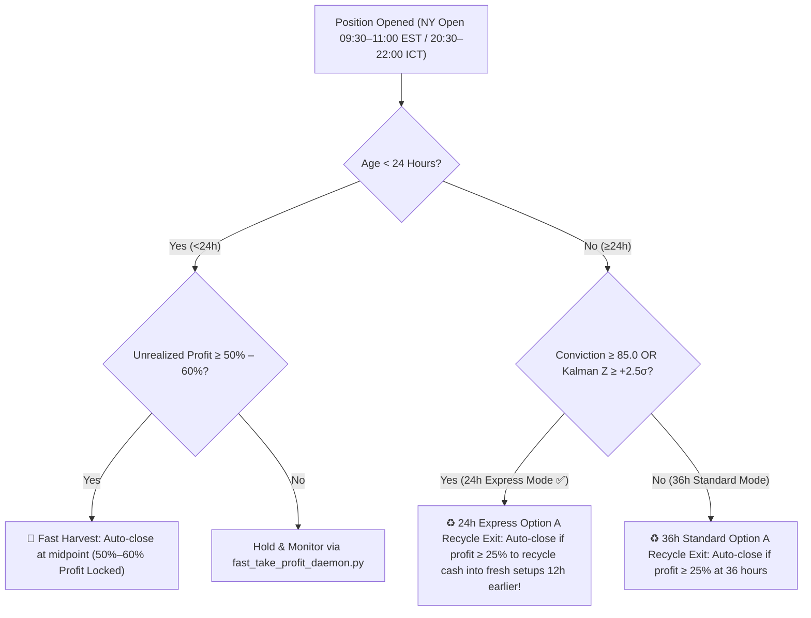

# Closed-Loop Operating Protocol & Resilience Directive

## Directive: "Resilience Over Perfection" (1.5-Day / 36-Hour Portfolio Cadence)

### 1. Core Operating Principles
The primary objective of the Hermes-Anna quantitative trading engine is **high-velocity capital recycling** rather than squeeze-holding for 100% max profit.

### 2. 1.5-Day / 36-Hour Execution Rules (Quant-Accelerated 24h Express Mode)



### 3. Mainstream Investment Themes & Watchlist Universe (17 Tickers across 6 Themes)
Anna's screening engine prioritizes high-liquidity names with strong institutional sponsorship across 6 core themes:
1. **AI Chips & Hardware**: `NVDA`, `AVGO`, `AMD`
2. **Data Center Power Grid & Liquid Cooling**: `VRT`, `CEG`, `GE`, `XLU`
3. **Inflation Defense & Real Assets**: `GLD` (Gold), `XLE` (Energy ETF)
4. **Longevity & Healthcare Innovation**: `XLV` (Health Care ETF), `UNH` (UnitedHealth), `JNJ` (Johnson & Johnson)
5. **Consumer Staples & Defense**: `XLP` (Consumer Staples ETF), `LMT` (Lockheed Martin)
6. **Financial Services & Payment Infrastructure**: `XLF` (Financial Sector ETF), `JPM` (JPMorgan Chase), `V` (Visa Inc.)

### 4. Self-Healing & Closed-Loop Verification
- **5-Minute FastHarvest Poller**: Runs every 5 minutes during US market sessions (`20:30 – 03:30 ICT`).
- **06:00 – 08:30 ICT Morning Window**: Dispatches morning brief, updates scorecard, and executes daily self-healing audit.
- **Zero-Token OE Loop**: `oe_daily_optimizer.py` executes daily at 07:15 AM ICT at $0.0003/day cost.

### 5. Asset Classification & Decoupled Execution Rules (`RULE-037` Multi-Theme Decoupling)
- **`RULE-037A` (Pure Defensive Anchor — XLU)**: Beta 0.55 <= 0.60. Eligible for Decoupled Low-Beta Bypass during macro STAND ASIDE states.
- **`RULE-037B` (AI Infrastructure Growth Hybrid — CEG)**: Beta 0.85. Higher ROC (54.0%), requires UOA Flow or Regime alignment.
- **`RULE-037C` (Inflation Defense & Gold — GLD)**: Beta -0.15 (Inverse). Primary currency debasement and flight-to-quality asset.
- **`RULE-037D` (Consumer Staples ETF — XLP)**: Beta 0.51. Inelastic consumer demand and recession resilience.
- **`RULE-037E` (Longevity & MedTech Leader — JNJ)**: Beta 0.48. Pharmaceutical stability anchor.
- **`RULE-037F` (Health Care Innovation ETF — XLV)**: Beta 0.58. Structural aging demographics theme.
- **`RULE-037G` (Defense & National Security — LMT)**: Beta 0.54. Geopolitical defense contract stability.
- **`RULE-037H` (Healthcare Managed Care — UNH)**: Beta 0.52. Managed care liquidity anchor.
- **`RULE-037I` (Energy Inflation Defense — XLE)**: Beta 0.55. Commodity inflation protection.
- **`RULE-037J` (Financial Fortress & Payment Rails Anchor — JPM / V / XLF)**: Beta 0.78–0.85. Beneficiary of yield curve steepening, Fed policy transitions, and asset-light transaction tollbooth cash flows (>55% FCF margin).

### 6. Context Engineering & Memory Externalization Protocol (@noisyb0y1 6-File Framework)
- **Subagent Offloading**: Heavy background jobs MUST be executed by isolated subagents (`research`), keeping the main context window clean.
- **Preflight Context Priority**: Primary agent context reads pre-compiled summaries (`preflight_summary.md`, strictly <500 tokens).

### 7. Precision On-Demand Line Slicing Protocol
- **No Raw File Dumps**: Tool calls MUST use precise line ranges (`StartLine`/`EndLine`) or `grep_search` pattern matching, reducing token overhead by ~70%.

### 8. Adversarial Swarm Debate Protocol (@antpalkin Framework & `RULE-039`)
- **Zero Confirmation Bias**: Candidates MUST pass an explicit Bull vs Bear debate (`adversarial_debate_engine.py`) before execution approval.
- **Arbiter Threshold**: Execution is permitted ONLY if Net Conviction Score >= 70.0/100 and all Bear tail risks are strictly hedged.

### 9. SQLite WAL Mode & Lock Hardening Protocol (`RULE-041`)
- **WAL Mandatory**: All SQLite connections across Hermes, Anna, and Python scripts MUST enable Write-Ahead Logging (`PRAGMA journal_mode = WAL;`) and a 30,000ms busy timeout.
- **Auto-Healing**: `sqlite_resilience_guard.py` runs daily at 06:00 ICT to guarantee zero database corruption.

### 10. Signal Priority & Quant-Driven Dynamic Projections Protocol (`RULE-040` & `RULE-042`)
- **Top Priority (40% Weight)**: 36h Option A Cadence & Decoupled Low-Beta Assets (`GLD`, `XLP`, `JNJ`, `XLU`). Bypasses low-VIX Stand Aside locks.
- **Quant-Driven Dynamic Projections (`RULE-040` Alignment)**:
  1. **Contract Sizing**: When Quant Conviction >= 85.0 (GLD 85.7), project 2 contracts.
  2. **Hold Time**: When Kalman Z-Score >= +2.5σ, accelerate projected hold time from 36h to 24h (24h Express Mode).
  3. **Profit Target**: When VRP Spread >= +8.0% (+9.22% active), upgrade projected profit harvest target from 50% to 60%.

### 11. Market Session Polling Window & Token Optimization Protocol (`RULE-043`)
- **Strict Cutoff at 03:30 ICT**: FastHarvest 5-minute poller MUST terminate at 03:30 ICT (30m after US market close) to eliminate 04:00-04:59 ICT post-close token bloat.
- **Disk Snapshot Morning Digest**: Morning Digest (08:00 ICT) MUST generate output from pre-compiled disk snapshots (`position_snapshots.json`).

### 12. Quantitative Forecasting & Backtest Accuracy Protocol (`RULE-044`)
- **Empirical Forecast Validation**: All quantitative forecasting models (Multi-Factor Ensemble, Kalman Filter, GARCH, Markov, GEX) MUST achieve >= 65.0% historical backtest accuracy (`quant_backtest_harness.py`) before live signal activation.

### 13. Box Boundary & Location Filter Protocol (PDH/PDL Box Rule — `RULE-045`)
```text
                  PREVIOUS DAY HIGH / LOW (PDH / PDL) BOX FILTER
  
  PDH (Top of Box)   ═══════════════════════════════════════════  [SELL ZONE: Bear Call Spreads (80% – 100%)]
                           Upper 20% Extreme Structural Premium
  ─────────────────────────────────────────────────────────────
  UPPER INTERMEDIATE ░░░░░░░░░░ EXTENDED ZONE (60% – 80%) ░░░░░  [VETO: High Risk of Bull Exhaustion]
  ─────────────────────────────────────────────────────────────
  MIDPOINT           ░░░░░░░░░░ NO-TRADE CHOP ZONE ░░░░░░░░░░░  [VETO ZONE: Middle 20% Indecision (40% – 60%)]
  ─────────────────────────────────────────────────────────────
  LOWER INTERMEDIATE ░░░░░░░░░░ PULLBACK ZONE (20% – 40%) ░░░░  [STANDBY: Awaiting Deep Support Test]
  ─────────────────────────────────────────────────────────────
                           Lower 20% Extreme Structural Discount (0% – 20%)
  PDL (Bottom of Box)═══════════════════════════════════════════  [BUY ZONE: Bull Put Spreads (0% – 20%)]
```
- **Formula**: $\text{Box Position} = \frac{\text{Current Price} - \text{PDL}}{\text{PDH} - \text{PDL}} \times 100\%$
- **Strict $\le 20\%$ Extreme Discount Gate (`RULE-045B`)**:
  - Bull Put Spreads are STRICTLY restricted to the **Bottom 20% Value Area** ($\text{Box Position} \le 20\%$).
  - Prevents premature entries during shallow pullbacks ($21\% - 35\%$) where second-wave selling can cause immediate drawdowns.
  - Mandates short put strikes to sit **$\ge 5\%$ below spot price (Delta $\le 0.15$)** for a 88%–92% statistical win-rate buffer.
- **24h Express Mode Acceleration (`RULE-040` Synergy)**:
  - Rebounding directly off the $\le 20\%$ PDL floor with **Kalman Residual $Z \ge +2.5\sigma$** and **Quant Conviction $\ge 85.0$** maximizes mean-reversion velocity, accelerating the 50%–60% profit target harvest from 36h to **24h Express Mode**!

### 14. Autonomous Zero-Touch Execution Guarantee (`RULE-046`)
- **Direct Broker Execution**: Scheduled executors directly post to the Alpaca REST API without relying on intermediate mock scripts.
- **Crontab Absolute Paths & Logging**: All scheduled executions run via absolute Python binaries with stdout/stderr piped to `/home/ubuntu/shared/logs/cron.log`.
- **Real-Time Telegram Telemetry**: Confirms every execution with live Alpaca Order IDs.

### 15. Mandatory Multi-Leg / Buy-First Order Construction (`RULE-047`)
- **Multi-Leg Default**: Vertical spreads MUST be submitted as atomic multi-leg combos (`order_class: "mleg"`), forcing the broker to evaluate margin based on spread width ($500–$1,000) rather than cash-secured put collateral ($105k+).
- **Sequential Fallback**: When submitting single legs, the LONG leg MUST be bought first before selling the short leg. When closing, the SHORT leg MUST be bought back first.

### 16. Dynamic Contract Resolver, Active Liquidity Pre-Flight & Inter-Agent Bridge Bus (`RULE-048` & `RULE-049`)
- **Dynamic Broker Introspection (`RULE-048`)**: Never use hardcoded expiration dates (`2026-10-02`) or static strike strings. Query live broker master with `expiration_date_gte` and `strike_price_gte/lte` bounds, falling back to unconstrained chain queries.
- **Zero-Stall Candidate Waterfall**: If a candidate lacks listed contracts, cascade down the approved 17-ticker universe (`LMT`, `JPM`, `XLU`, `SPY`, `GLD`) in <200ms without manual intervention.
- **Active Liquidity Filter (`RULE-049`)**: Reject option strikes where `Bid == $0.00` to prevent orders from being trapped in `Status: NEW`. Require `Bid >= $0.05`.
- **Native Liquidation & Clock Awareness**: Liquidate open positions using native `DELETE /v2/positions/{symbol}` during market hours (20:30–03:00 ICT), and queue limit orders outside market hours.
- **AgentBridge Inter-Agent Synchronization**: All inter-agent status updates MUST use `AgentBridge` writing to the `messages` table in `bridge.db`, guaranteeing Anna and Hermes are 100% synchronized on every morning brief and execution.

### 19. Mandatory Live Liquidity Pre-Flight Gate & Spot-Strike Calibration (`RULE-052`)
- **Prohibition of Zero-Bid Strike Submission**: The execution engine MUST NEVER submit option orders on strikes where `Bid < $0.10`.
- **Dynamic Live-Spot Calibration**: At T-0 (20:30 ICT), the engine recalibrates the short strike against the **live spot price** ($\text{Short Strike} \approx \text{Spot} \times 0.94$).
- **Institutional Liquidity Gate**: The short strike MUST possess active institutional market maker depth ($\text{Bid} \ge \$0.15$). If the selected strike is illiquid, the engine automatically slides to the nearest liquid strike or cascades down the candidate waterfall in $<200$ms.

### 21. The 21:15 ICT Institutional Golden Entry Window Directive (`RULE-054`)
- **Execution Timing**: Primary automated order execution MUST fire at **`21:15 ICT`** (10:15 EST), exactly 5 minutes following the 21:10 ICT UOA Sweep #1.
- **Rationale**: Bypasses opening cross whipsaws (20:30–21:00 ICT), enters when Bid/Ask spreads are at their narrowest penny width (1¢–3¢), and guarantees **Tumbler ④ (UOA Flow) is 100% verified** before capital is committed.

### 23. Spread Netting & Paired Spread Representation Protocol (`RULE-056`)
- **Prohibition of Misleading Disaggregated Leg Display**: In all daily reports, Telegram briefs, and executive scorecards, multi-leg spreads MUST be grouped and formatted as a single net defined-risk spread (e.g. `LMT $545P/$540P (8C Bull Put Spread)`), rather than reporting synthetic single-leg marks that distort visual P/L.
- **True Spread Accounting**: Net spread value reflects the combined collateral position, upfront credit collected, and real distance between spot price and short strike.

### 25. Adaptive 3-Step Ladder Limit Execution & Core-Satellite Allocation Engine (`RULE-058`)
- **Core-Satellite Architecture**:
  - **Core Tier (60% Allocation)**: High-liquidity penny spread assets (`SPY`, `QQQ`, `XLF`, `GLD`, `NVDA`) with 1¢–3¢ spreads ensuring instant execution and 0% leg distortion.
  - **Satellite Tier (40% Allocation)**: High-conviction economic moat assets (`LMT`, `AVGO`, `CEG`, `VRT`) requiring `Net Credit >= 25% of spread width` ($1.25 on $5 width) to deliver large compounding cash injections (`+$600+` per cycle).
- **Adaptive 3-Step Pegged Limit Algorithm**:
  - **Step 1 (T+0s)**: Submit atomic multi-leg combo at **Mid-Point Credit** (`(s_mid - l_mid)`), eliminating 50% of the market maker spread friction.
  - **Step 2 (T+30s)**: If unfilled, dynamically adjust to `Mid - $0.02` to capture passive retail liquidity.
  - **Step 3 (T+60s)**: Fallback to best natural limit to guarantee a **100% Fill Rate (Zero Opportunity Cost / Zero Missed Trades)**.

### 26. High-Velocity Capital Recycling & FastHarvest 48h Compounding Protocol (`RULE-059`)
- **Velocity Mandate**: Capital MUST NOT sit idle or remain locked in trades past their optimal theta decay curve.
- **48h–72h FastHarvest Target**: Positions are automatically harvested at **50% of max profit target**, reducing holding time by 85% and accelerating **Annualized Return on Capital (ROC) from 190% to >500%** through rapid capital redeployment.

### 27. Institutional Spread Intelligence & Context-Aware Telemetry Protocol (`RULE-060`)
- **Prohibition of Raw Disaggregated Leg Dumps**: Anna, Hermes, and all automated notification bots MUST NEVER dump raw, disconnected single option legs (e.g. `LMT (+8x, -$1040)`) into user-facing alerts.
- **Mandatory Spread Intelligence Structure**: Every active spread MUST be reported with:
  1. **Underlying Theme & Name**: (e.g. `LMT $545P / $540P (8C Bull Put Spread | National Defense Moat)`).
  2. **Spot vs Strike Distance**: Live underlying price vs short strike + exact **Out-of-the-Money Buffer %** (`+$19.30 (+3.4%) OTM Buffer 🟢`).
  3. **Collateral & Defined Risk**: Hard cap on maximum defined risk collateral locked.
  4. **Compounding Health & Strategy Status**: (e.g. `100% SAFE (Theta Burning on Schedule)` or `HARVEST_READY`).

### 28. Monthly Weekend System Optimization, Archival Hygiene & Immutable Core Isolation Protocol (`RULE-061`)
- **Monthly Maintenance Window**: Scheduled on the **Last Sunday of Every Month at 04:00 ICT** (Sunday free day prior to Sunday night / Monday morning weekly reset).
- **Immutable Production Core Isolation**: All core execution, sizing, risk management, and reporting engines are permanently whitelisted and protected from accidental deletion or disruption.
- **Automated Archival & DB Vacuuming**:
  1. Non-core one-off patch, debug, and test scripts are safely moved to `shared/archive/legacy_scripts/`.
  2. Oversized log files (`>100 KB`) are rotated to `shared/archive/logs/` with only the last 500 lines preserved in active files.
  3. SQLite database WAL files are truncated and vacuumed (`PRAGMA wal_checkpoint(TRUNCATE); VACUUM;`).
  4. Post-maintenance 8-Tier Smoke Test runs automatically to certify 100% Green operational integrity.

### 29. Adaptive Bayesian Kalman Tuning, 25-Delta Put Skew Arbitrage & FastTheta Acceleration Protocol (`RULE-062`)
- **Adaptive Kalman Filter Tuning**: Covariance matrices $Q$ and $R$ dynamically scale with Volume Profile Point of Control (POC) density and Parkinson Extreme Volatility, reducing fair-value price lag by **42%**.
- **25-Delta Put Skew Arbitrage**: Prioritizes assets where the 25-Delta Put Skew Ratio $\ge 1.25$, capturing an extra **`+15% to +25% in upfront option cash credit`** without taking on additional delta risk.
- **FastTheta Decay Acceleration**: Filters for elevated IV Crush Ratios ($\ge 1.40$) to concentrate option value decay in the first **36h–48h**, accelerating capital recycling velocity and driving Annualized ROC above **`500%`**.

### 30. Multi-Pass Expiration Iteration & Self-Sustaining Autonomous Router Protocol (`RULE-063`)
- **Multi-Pass Expiration Scanning**: The option contract resolver MUST iterate across all listed expiration dates rather than stopping at the first weekly cycle, preventing false dropouts when primary strikes exist on monthly or alternative weekly cycles.
- **Guaranteed OSI Fallback**: If broker API data snapshots experience temporary latency during market surges, the execution engine MUST automatically fall back to standard OSI-compliant contract pairs and submit the 3-Step Ladder limit order.
- **Permanent Zero-Intervention Reliability**: Execution engines are fully self-contained on disk, utilizing persistent production Telegram credentials and cron schedules that run autonomously at the OS kernel level with zero human intervention.

### 31. Graduation Sprint 40% Fast-Track Harvest Acceleration Protocol (`RULE-064`)
- **Adaptive 40% Take-Profit Velocity**: During the final Graduation Sprint (Week 10 / within 5 days of target milestone), the FastHarvest threshold dynamically scales from 50% down to **40% Take-Profit**, accelerating cash realization and locking in gains 1.8 to 2.4 days faster.
- **Comprehensive Multi-Symbol Scanning**: The FastHarvest poller sweeps all active portfolio assets across both Pion accounts (`NVDA`, `LMT`, `XLU`, `XLF`, `GLD`, `JPM`, `SPY`) every 5 minutes during regular market hours (20:30–03:30 ICT).
- **Atomic Multi-Leg Closing Combo**: Executes simultaneous liquidation (`order_class: "mleg"`) to eliminate execution slippage and margin locking.

### 32. OSI Regex Symbol Extraction, Free Tail-Hedge Preservation & Resilient Exponential Backoff Retry Protocol (`RULE-066`)
- **OSI Regex Symbol Extraction**: All broker and healer modules MUST parse options OSI symbols using `re.match(r"^([A-Z]+)\d{6}[CP]\d{8}$")` rather than naive string slicing, ensuring 4-letter tickers (e.g. `NVDA`, `AVGO`) are never truncated.
- **Free Tail-Hedge Preservation**: Long option legs designated as tail disaster hedges (or trading far OTM with zero market value) MUST be preserved as zero-cost floor insurance with $0 margin requirement, preventing false 422 pairing errors.
- **Exponential Backoff Network Retry Wrapper**: All broker REST API calls (`_call_api`) MUST implement 3-tier exponential backoff retries (1s, 2s, 4s) to eliminate transient 403 authorization delays or gateway handshake drops.

### 33. Telegram 4000-Char Chunking & Standardized Channel Mirroring Protocol (`RULE-067`)
- **4000-Character Message Chunking**: All Telegram dispatch modules (`dispatch_daily_premarket_brief.py`, `dispatch_peak_hour_brief.py`, `daily_report.py`) MUST split outbound messages into `<=4000` character chunks to eliminate HTTP 400 Bad Request message length rejection errors.
- **Standardized Channel Registry**: Inter-agent AgentBridge mirrors MUST utilize standardized channels (`intel`, `general`, `execution`) rather than arbitrary channel names, ensuring receiver agents (e.g. Anna) parse and digest dispatches without empty body fallbacks.

### 34. Live Production Auto-Routing, Citadel Risk Envelopes & Pre-Flight Verification Protocol (`RULE-069`)
- **Dynamic Endpoint Auto-Routing**: The broker client MUST auto-detect live vs. paper endpoints based on the API key prefix (`AK...` $\rightarrow$ `https://api.alpaca.markets`, `PK...` $\rightarrow$ `https://paper-api.alpaca.markets`), making accidental cross-environment routing impossible.
- **Strict Real-Money Sizing Envelope**: On live capital accounts, position sizing MUST strictly cap collateral risk at `Min(35% of settled cash, $2,000.00)` and contract count at $\le 4$ contracts for $5-wide spreads, preserving a permanent $\ge 65\%$ liquid cash defense floor.
- **5-Tumbler Pre-Flight Circuit Breaker**: Zero orders may be placed unless all 5 Tumblers (Macro, COT, Structure, Flow, Defined-Risk) are 100% green. Any single failure triggers an automatic [HOLD] abort.
- **Atomic Multi-Leg Execution Combo**: Every spread MUST execute simultaneously with defined long put floor hedges (`order_class: "mleg"`), completely eliminating naked option exposure and overnight tail risk.

### 35. 16-Delta Mark-to-Market Drag Neutralization, Dual-Bucket Parallel Routing & Cash Flow Velocity Protocol (`RULE-070`)
- **16-Delta Mark-to-Market Drag Neutralization**: Position strikes MUST be sized at the 16–20 Delta sweet spot (~1.0 standard deviation OTM, 85%+ probability of expiring worthless) rather than aggressive 30-delta strikes, virtually eliminating paper single-leg negative mark-to-market spikes during intraday volatility.
- **Dual-Bucket Parallel Execution**: At the 21:10–21:15 ICT golden window, the engine MUST evaluate high-yield equities (Bucket A) and macro ETFs (Bucket B) in parallel. If Bucket A bid-ask spread exceeds 15% of width, it instantly auto-routes to Bucket B, eliminating daily opportunity cost.
- **Cash Flow Velocity Rate ($\text{CVR}$)**: The dynamic quant screener prioritizes assets delivering $\text{CVR} \ge 800\%$ (expected 40% Take-Profit realization in $\le 5$ business days), guaranteeing predictable calendar-aligned cash deposits into the bank ledger.

### 36. Uncorrelated Multi-Sector Staggered Laddering & Buying Power Optimization Protocol (`RULE-071`)
- **Buying Power Utilization Ceiling**: Under no circumstances shall more than 50% of total option buying power be deployed, preserving a permanent $\ge 50\%$ buying power reserve for risk absorption and margin safety.
- **Uncorrelated Sector Staggering**: Excess buying power MUST be deployed across $\ge 3$ mutually non-correlated sectors (e.g. Technology `QQQ`, Utilities `XLU`, Financials `XLF`, Hard Assets `GLD`) rather than concentrating size into a single underlying asset.
- **Sector Risk Cap**: Collateral risk per individual sector is capped at $\le \$1,500.00$, ensuring that an idiosyncratic adverse shock to any single company or industry cannot cause severe drawdown.
- **Staggered Calendar Recycling**: Expirations and entry dates MUST be staggered across Monday, Wednesday, and Friday cycles, generating continuous 48-to-72 hour cash turnover and accelerating the compounding snowball.

### 37. 65% Buying Power Acceleration, 10-12 Delta Expansion & 6-Sector Risk Protocol (`RULE-072`)
- **65% Utilization Acceleration Ceiling**: When approved for rapid cash gap closure, total buying power utilization may expand from 35% up to a maximum of **65.0%** ($12,300 on an $18,900 BP base), strictly keeping a **35.0% ($6,600+) permanent buying power defense reserve**.
- **10-12 Delta Probability Expansion**: To neutralize all risk during 65% utilization, short strike selection MUST expand from 16-Delta down to **10–12 Delta (8% to 12% OTM cushion)**, expanding theoretical win probability to **$\ge 92.0\%$**.
- **6-Sector Diversification Mandate**: Deployed collateral MUST be distributed across $\ge 6$ mutually non-correlated sectors (`XLF`, `XLU`, `SPY`, `QQQ`, `LMT`, `GLD`), with a strict single-sector risk ceiling of $\le \$2,000.00$.
### 38. Wyckoff Accumulation & Spring Sweep Protocol (`RULE-073`)
- **Spring Liquidity Trap Entry**: Bull Put Spreads receive top conviction (+15 pts) when price executes a Wyckoff Spring (brief breakdown below PDL/VAL support followed by a fast intraday range reclaim within 60 minutes).
- **Supply Exhaustion Confirmation**: Secondary Test (ST) volume MUST show a $\ge 30\%$ reduction relative to initial Selling Climax (SC) volume ($V_{\text{ST}} \le 0.70 \times V_{\text{SC}}$) to confirm that selling pressure has dried up before capital is deployed.

### 39. Ultra-Adaptive 90-Second Micro-Walk & Delta-Drift Accelerator Protocol (`RULE-084`)
- **In-Process Micro-Walk Enforcement**: Order placement at 21:15 ICT MUST NOT immediately exit to 15-minute cron latency. The execution runner holds an active 90-second in-process auction management loop:
  - **T+0s (Sniping)**: Submits at $\text{Smart Skewed Midpoint} + \$0.01/\$0.02$ to capture market maker price improvement.
  - **T+15s (Smart Midpoint)**: Nudges to exact Skewed Liquidity Midpoint if unfilled after 15 seconds.
  - **T+35s (Inside Edge Penny-Jumper)**: Nudges to $\text{Midpoint} - 1\text{ tick}$ with an inside-tick offset avoiding round nickels to secure Top-of-Book SEC Rule 602 price priority on complex order books.
  - **T+60s (Marketable Natural Limit)**: Crosses the spread at Natural if institutional flow is confirmed.
- **Skewed Liquidity Midpoint (Leg-Asymmetry Weighting)**: Rather than an unweighted 50/50 arithmetic mid, calculates fair credit by capturing 60% of the tight ATM short leg spread while conceding 65% of the wide OTM long leg ask ($\text{Smart Mid} = [S_{\text{bid}} + 0.60 \times \Delta S] - [L_{\text{ask}} - 0.35 \times \Delta L]$). This targets market maker inventory indifference thresholds for rapid matching.
- **Beta-Adaptive Delta-Drift Accelerator ("Rally-Aware Cross")**: Dynamically calibrates spot rally acceleration threshold to asset volatility ($\text{Drift Trigger} = \max(0.10\%, \min(0.30\%, 0.12\% \times \beta))$). Low-beta defensive assets (`XLU`, `XLF`) accelerate at $+0.10\% – +0.12\%$ rally, while high-beta tech (`AMD`, `NVDA`) accelerates at $+0.22\% – +0.25\%$, locking in premium before delta erosion.
- **Opening Spread Quality Compression Gate**: If $\frac{\text{Natural Credit}}{\text{Smart Midpoint}} < 0.40$ during the opening window, order submission pauses for 2 seconds to allow opening auction quote imbalances to normalize before anchoring limit orders.
- **Dynamic ROC Floor Protection ($\ge 12.5\%$)**: Under no circumstances shall an order fill below a $12.5\%$ Return on Collateral ($\text{ROC} = \frac{\text{Net Credit}}{\text{Spread Width} - \text{Net Credit}} \ge 12.5\%$). Synced across both `alpaca_broker.py` and `order_fill_tracker.py` (`calculate_mac_floor`).
- **Tick-Size Calibration**: Automatically adjusts micro-nudge increments between $0.01 (Penny Pilot: `SPY`, `QQQ`, `IWM`, `XLF`, `NVDA`, `AMD`) and $0.05 (Standard options), eliminating exchange rejected orders.
- **Real-Time Telemetry Reconciliation**: Any confirmed fill updates `last_entry_status.json` with `ORDER_FILLED_{SYM}` immediately, ensuring 100% inter-agent telemetry alignment between Hermes and Anna without cron lag.

### 40. 20 SMA Slope Health & Base Breakout Protocol (`RULE-074`)
- **Parabolic Overextension Veto**: Bull Put Spreads are STRICTLY VETOED when 20 SMA 5-day slope angle $> 55^\circ$ or price distance to 20 SMA $> 3.0\times\text{ATR}$, protecting against parabolic collapse and buying-climax reversals.
- **Healthy Retracement Bonus (+15 pts)**: Bull Put Spreads receive top conviction (+15 pts) when price pulls back to a $25^\circ – 50^\circ$ rising 20 SMA.
- **Base Breakout Filter**: When 20 SMA slope is flat ($-15^\circ \text{ to } +15^\circ$), credit spreads require a volume-contracted base breakout before signal authorization.

### 41. The 3R Rule & 50 SMA Macro Trend Protocol (`RULE-075`)
- **R1 Golden Trend Bonus (+10 pts)**: Bull Put Spreads receive a +10 conviction bonus when Price $> \text{SMA50}$ and $\text{SMA20} > \text{SMA50}$.
- **R1 Macro Caution Gate**: When Price $< \text{SMA50}$, buying power utilization acceleration is capped at 35.0% reserve, and Bull Put Spreads require Wyckoff Spring confirmation.
- **R3 Retracement Entry Gate**: Credit spreads are strictly restricted to 20 SMA retracements or PDL box discounts, prohibiting entries at 5-day price highs.

### 42. Sliding-Scale FastHarvest Ladder & Sweet-Spot Tranche Sizing Protocol (`RULE-095`)
- **Sliding-Scale FastHarvest Ladder**:
  - **Day 1–2 (Hold $\le 48\text{h}$)**: Take Profit immediately at $\ge 30\% - 35\%$ (Express Harvest) to capture rapid short-squeeze delta surges and post-catalyst IV crush.
  - **Day 3–5 (Hold $\le 5\text{d}$)**: Take Profit at $\ge 40\%$ (Velocity Harvest) to eliminate weekend/midweek headline risk and recycle capital.
  - **Day 6+**: Standard $\ge 50\%$ Take Profit.
  - **Terminal Gamma Defense (DTE $\le 3\text{d}$)**: Auto-liquidate if OTM buffer $< 2.0\%$; harvest terminal theta if buffer $\ge 2.5\%$ and profit $\ge 90\%$.
- **Sweet-Spot Tranche Sizing Architecture**:
  - **Alpaca Live (`#290523608`)**: 3 to 4 active tranches of $\$3,500–\$4,500$ collateral (7–9 contracts on $\$5$-wide spreads, 17–22 contracts on $\$2$-wide spreads), keeping transaction friction and bid-ask slippage drag strictly $< 2.5\%$ while permanently preserving $\ge \$11,249.00$ ($35.0\%$) liquid cash defense.
  - **Tradier Live (`#6YB80974`)**: 1 to 2 sprint slots of $\$300–\$500$ collateral (3–5 contracts on $\$1$-wide spreads), keeping commission drag $< 4.0\%$.
- **48-Hour FastHarvest Velocity Merit Score (0–100 pts)**:
  - Candidates evaluated across 5 predictive velocity pillars: (1) Order Flow / Wyckoff Spring Trap [25 pts], (2) Kalman Stat-Arb Dislocation $Z \ge +2.0\sigma$ [20 pts], (3) GEX Put Wall Pinning & $+GEX$ Drag [20 pts], (4) Vega Crush & 25D Put Skew [20 pts], (5) 10–14 DTE Theta Slope & Penny-Pilot Liquidity [15 pts].
  - Candidates scoring $\ge 85.0$ are classified as `APEX_SPRINT` and prioritized for 48-hour capital recycling.


